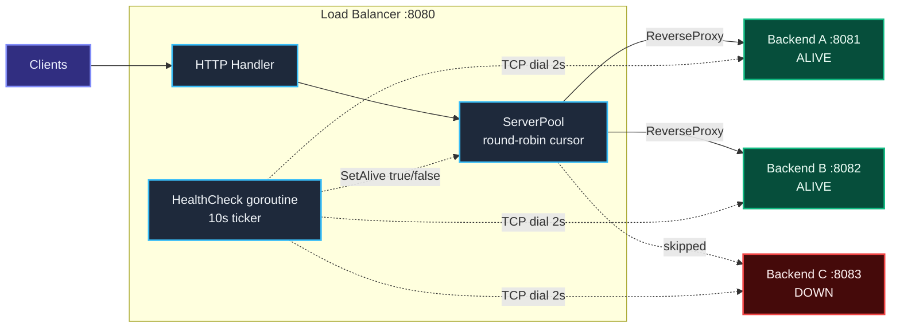
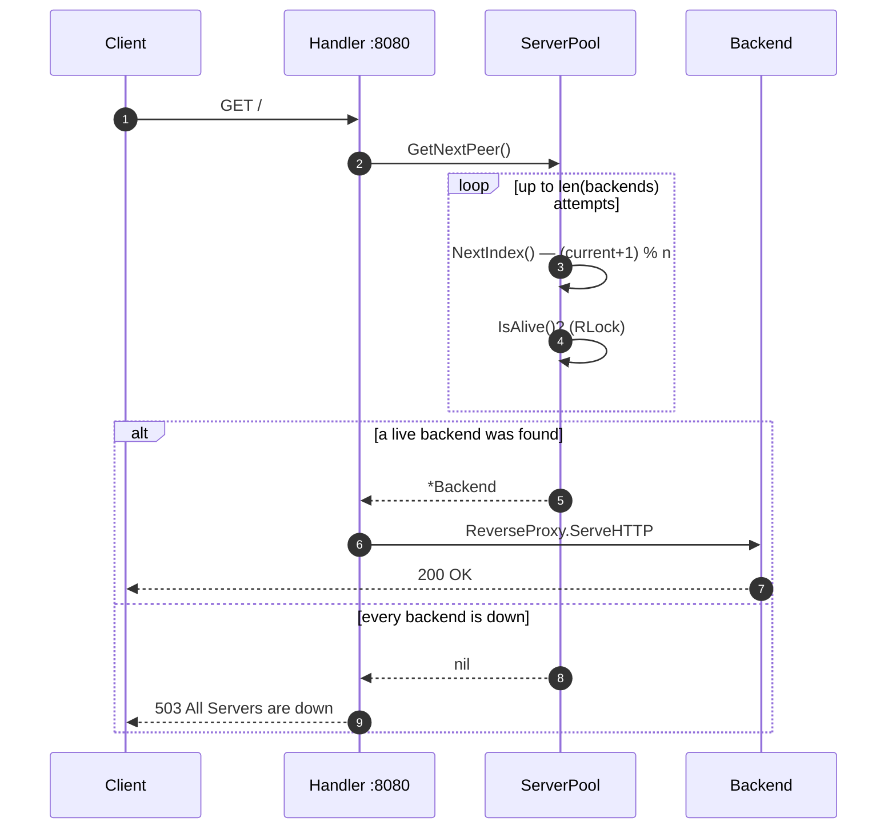

# go-distributed-load-balancer

A round-robin HTTP load balancer written in Go using only the standard library. It fans incoming requests across a pool of backend servers, skips any backend that is unreachable, and continuously re-checks dead backends so they rejoin the rotation on their own.

No dependencies. No config files. One `main.go`.

## Architecture



## How a request is routed



## How it works

| Piece | Role |
| --- | --- |
| `Backend` | One upstream server: parsed URL, an `Alive` flag guarded by an `RWMutex`, and its own `httputil.ReverseProxy`. |
| `ServerPool` | Holds the backends and the round-robin cursor. `NextIndex()` advances `(current + 1) % len(backends)` under a mutex. |
| `GetNextPeer()` | Walks the ring at most `n` times looking for a backend where `IsAlive()` is true. Returns `nil` if the whole pool is down. |
| `HealthCheck()` | Runs in its own goroutine on a 10-second ticker. TCP-dials each backend host with a 2-second timeout and flips `Alive` accordingly. |

Read locks for the hot path (`IsAlive`), write locks only when a health check changes state — so request routing never blocks behind a health probe.

## Running it

The balancer listens on `:8080` and expects backends on `:8081`, `:8082`, and `:8083`.

```bash
go run main.go
```

Spin up three throwaway backends in separate terminals to watch it work:

```bash
# terminal 1
python3 -m http.server 8081
# terminal 2
python3 -m http.server 8082
# terminal 3
python3 -m http.server 8083
```

Then send some traffic:

```bash
for i in $(seq 1 6); do curl -s localhost:8080 > /dev/null; done
```

The balancer logs each hop:

```
Forwarding request to http://localhost:8081
Forwarding request to http://localhost:8082
Forwarding request to http://localhost:8083
Forwarding request to http://localhost:8081
```

Kill one backend and, within 10 seconds, the health checker notices and takes it out of the rotation:

```
Starting health check...
Backend is down: localhost:8082
```

Bring it back and it rejoins automatically on the next tick.

## Configuring backends

The pool is defined in `main.go`:

```go
serverList := []string{
    "http://localhost:8081",
    "http://localhost:8082",
    "http://localhost:8083",
}
```

Edit the slice to point at your own upstreams.

## Requirements

Go 1.27 or newer. Nothing else.

## Roadmap

- [ ] Backend list from CLI flags or a config file instead of a hardcoded slice
- [ ] Weighted and least-connections strategies alongside round-robin
- [ ] HTTP health checks (`GET /health`) rather than a bare TCP dial
- [ ] Retry the next peer on proxy error via `ReverseProxy.ErrorHandler`
- [ ] Structured logging and a `/metrics` endpoint
- [ ] Graceful shutdown on SIGTERM
